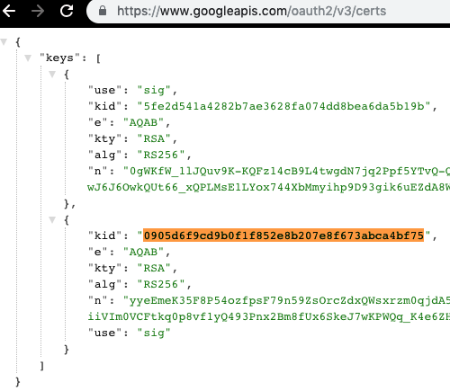
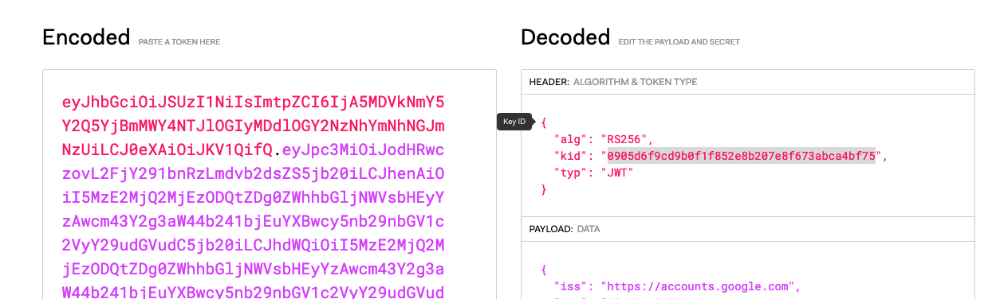

**Table of Contents**

- [Security-Demo](#security-demo)
  - [Getting started](#getting-started)
  - [Start the project](#start-the-project)
    - [Configuration/Profile](#configurationprofile)
  - [Testing](#testing)
    - [Example of KID (Key ID) and self validation...](#example-of-kid-key-id-and-self-validation)
    - [Some CURL in example...](#some-curl-in-example)


# Security-Demo
This project just shows how you can integrate an OpenID security in your SpringBoot 2.1+ projects.  
Target is to secure an API by requesting a Json Web Token through the Authorization header.  
This project does not provide an oauth2 client.  

The default configuration is ready to use with Google OpenID provider. If you use it you will need a google client_id that can be obtain through the [Google developer console](https://console.developers.google.com)  

## Getting started
To build the project you just need a Java 8+ version installed with Maven 3+.

```bash
mcv clean package
```

If the build worked good you will have the final binary created into the `target` folder

```bash
$ ls target/*.jar
target/security-demo-0.0.1-SNAPSHOT.jar
```

## Start the project 
Once built you can simply start your project as for SpringBoot, all the requirements are packaged together.

```bash
java -jar target/security-demo-0.0.1-SNAPSHOT.jar
```

### Configuration/Profile
If you take a look into the `application.yml` file, containing the project configuration, you can see several "profiles"

```yaml
spring:
  security:
    oauth2:
      resourceserver:
        jwt:
          issuer-uri: https://accounts.google.com
```

By default i use google as openid provider. If you want to test another provider just replace the issuer-uri with yours.


## Testing
Once the project is started up you can make a simple test to the 2 predefined APIs

* GET /api/v1/demo
* GET /api/v1/hello

### Example of KID (Key ID) and self validation...

Here we only provide as information the issuer uri (google) : https://accounts.google.com  
Spring will determinate the openid discovery endpoint by adding /.well-known/openid-configuration which give https://accounts.google.com/.well-known/openid-configuration  
Inside this dicovery endpoint, spring boot will search for the jwks_uri endpoint, here we have : https://www.googleapis.com/oauth2/v3/certs, with two RSA public key available  
  

Once authenticated, i can see that my Google JWT token is using the second public key.  
  

Now we can play with below API example to check if spring boot is well validating the signature with those api keys...  

### Some CURL in example...

Testing without any authentication should give you a HTTP Unauthorized response

```bash
$ curl -v http://localhost:8080/api/v1/hello
 *   Trying ::1...
 * TCP_NODELAY set
 * Connected to localhost (::1) port 8080 (#0)
 > GET /api/v1/hello HTTP/1.1
 > Host: localhost:8080
 > User-Agent: curl/7.54.0
 > Accept: */*
 >
 < HTTP/1.1 401
 < Set-Cookie: JSESSIONID=10A35B32A84FB67E3738A503079776E2; Path=/; HttpOnly
 < WWW-Authenticate: Bearer
 < X-Content-Type-Options: nosniff
 < X-XSS-Protection: 1; mode=block
 < Cache-Control: no-cache, no-store, max-age=0, must-revalidate
 < Pragma: no-cache
 < Expires: 0
 < X-Frame-Options: DENY
 < Content-Length: 0
 < Date: Thu, 21 Mar 2019 12:18:53 GMT
 <
 * Connection #0 to host localhost left intact
```

If you add the correct Authorization Header (for the system you want to use) you should have the good response.

```bash
$ curl -v http://localhost:8080/api/v1/hello \
  -H 'Authorization: Bearer eyXXX'
*   Trying ::1...
* TCP_NODELAY set
* Connected to localhost (::1) port 8080 (#0)
> GET /api/v1/hello HTTP/1.1
> Host: localhost:8080
> User-Agent: curl/7.54.0
> Accept: */*
> Authorization: Bearer eyXXX
>
< HTTP/1.1 200
< X-Content-Type-Options: nosniff
< X-XSS-Protection: 1; mode=block
< Cache-Control: no-cache, no-store, max-age=0, must-revalidate
< Pragma: no-cache
< Expires: 0
< X-Frame-Options: DENY
< Content-Type: text/plain;charset=UTF-8
< Content-Length: 44
< Date: Thu, 21 Mar 2019 12:22:29 GMT
<
* Connection #0 to host localhost left intact
Hello, your id is xxxx and name is alexandre faria
```

The api/v1/demo endpoint require the scope attribute containing email.
If your JWT token does not contain that required attribute into the payload, you'll get a 403 as below :  

```bash
$ curl -v http://localhost:8080/api/v1/demo \
  -H 'Authorization: Bearer eyXXX'
*   Trying ::1...
* TCP_NODELAY set
* Connected to localhost (::1) port 8080 (#0)
> GET /api/v1/demo HTTP/1.1
> Host: localhost:8080
> User-Agent: curl/7.54.0
> Accept: */*
> Authorization: Bearer eyXXX
>
< HTTP/1.1 403 Forbidden
< WWW-Authenticate: Bearer error="insufficient_scope", error_description="The token provided has insufficient scope [] for this request", error_uri="https://tools.ietf.org/html/rfc6750#section-3.1"
< Cache-Control: no-cache, no-store, max-age=0, must-revalidate
< Pragma: no-cache
< Expires: 0
< X-Content-Type-Options: nosniff
< X-Frame-Options: DENY
< X-XSS-Protection: 1 ; mode=block
< Referrer-Policy: no-referrer
< content-length: 0
```
